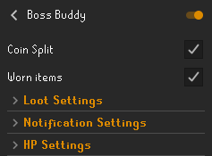
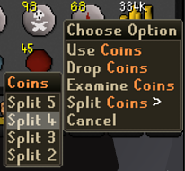
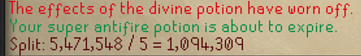
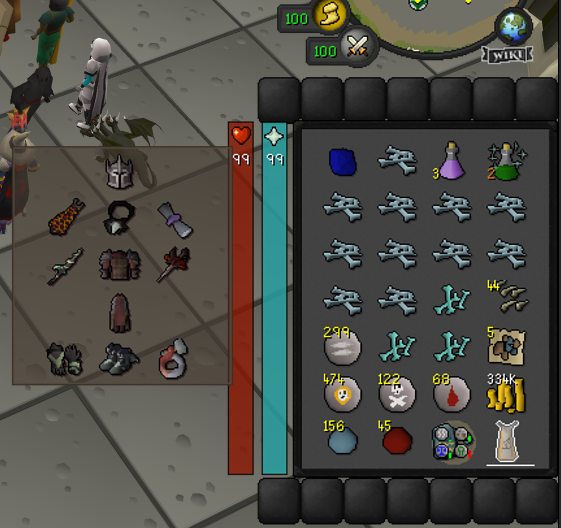
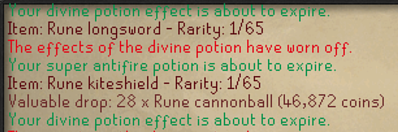
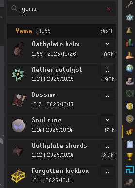
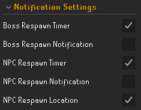
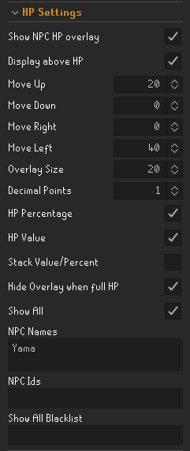
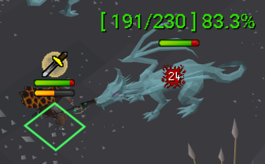

Various functions to aid in fighting/tracking NPCs.

These functions all exist in other plugins, but they lacked some functionality that I was looking for.  
So I decided to make a plugin to add what I thought was missing and bundle them together.

Inspiration/examples I used:  

Worn Equipment Viewer Plugin - iGundamStyle,JZomDev  
Better NPC Highlight Plugin - Buchus  
Monster HP Percentage Plugin - Le Jeffe   
Runelite Bank Plugin  
Runelite Loot Tracker Plugin  

<h1>Boss Buddy Plugin</h1>
Track Drops/Monster Information/Gearing Assistance

<h1>Coin Split</h1>
Add right click option to coins stacks for easy splitting after a drop.

<h1>Worn Items</h1>
Overlay to display currently equipped items while using the Bank interface to help prevent missing gear.

<h1>Loot Settings</h1>
Display Wiki drop rate data/Track drop kill count, date, GE value at the time of drop

Set minimum drop rate that you would like to see displayed in the chat.

Set minimum GE value of drops that you would like to track in the side panel.2

<h1>Notification Settings</h1>
Enable respawn timer/location/notification for bosses and/or rank and file NPCs.

<h1>HP Settings</h1>
Customizable overlay to display NPC HP information.

